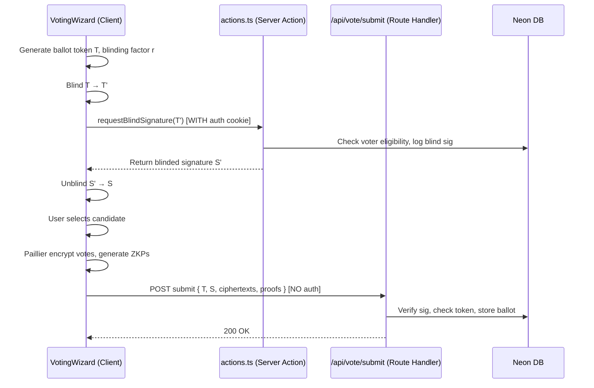
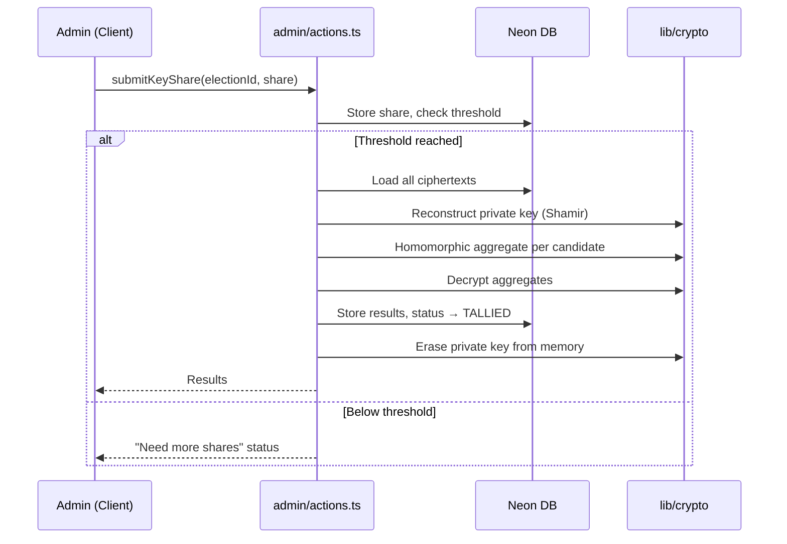

# S009 — Next.js App Router Architecture & Folder Structure

## Goal

Restructure the Secure E-Voting system as a **Next.js App Router** application using **server/client components**, an **MVC-inspired features-based folder structure**, **Neon + Drizzle ORM** for the database, and a dedicated `lib/crypto` module for all cryptographic operations.

---

## Folder Structure

```
secure-e-voting/
├── .env.local                          # Neon DB URL, JWT secret, etc.
├── package.json
├── next.config.ts
├── drizzle.config.ts                   # Drizzle Kit config (Neon connection)
├── tsconfig.json
├── middleware.ts                        # Next.js middleware (auth guard, role check)
│
├── src/
│   ├── app/
│   │   ├── layout.tsx                  # Root layout (server component) — fonts, providers
│   │   ├── page.tsx                    # Landing / public elections list
│   │   ├── globals.css
│   │   │
│   │   ├── (auth)/                     # Route group — auth pages (no layout nesting)
│   │   │   ├── login/
│   │   │   │   └── page.tsx
│   │   │   └── register/
│   │   │       └── page.tsx
│   │   │
│   │   ├── elections/
│   │   │   ├── page.tsx                # All elections list
│   │   │   └── [electionId]/
│   │   │       ├── page.tsx            # Election detail (candidates, status)
│   │   │       ├── vote/
│   │   │       │   └── page.tsx        # Voting flow page (client-heavy)
│   │   │       └── results/
│   │   │           └── page.tsx        # Results page (charts)
│   │   │
│   │   ├── admin/
│   │   │   ├── layout.tsx              # Admin layout with sidebar (server — role guard)
│   │   │   ├── page.tsx                # Admin dashboard
│   │   │   ├── elections/
│   │   │   │   ├── page.tsx            # Manage elections list
│   │   │   │   ├── create/
│   │   │   │   │   └── page.tsx        # Create election + key ceremony
│   │   │   │   └── [electionId]/
│   │   │   │       └── page.tsx        # Manage single election
│   │   │   └── tally/
│   │   │       └── [electionId]/
│   │   │           └── page.tsx        # Key share submission + tally trigger
│   │   │
│   │   └── api/                        # Route Handlers (REST-style, for anonymous endpoints)
│   │       └── vote/
│   │           └── [electionId]/
│   │               └── submit/
│   │                   └── route.ts    # POST — anonymous ballot submission (no auth)
│   │
│   ├── features/                       # ★ MVC-style feature modules
│   │   ├── auth/
│   │   │   ├── components/
│   │   │   │   ├── LoginForm.tsx       # "use client"
│   │   │   │   └── RegisterForm.tsx    # "use client"
│   │   │   └── actions.ts             # Server actions: loginAction, registerAction
│   │   │
│   │   ├── elections/
│   │   │   ├── components/
│   │   │   │   ├── ElectionCard.tsx    # Server component (static display)
│   │   │   │   ├── ElectionList.tsx    # Server component (fetches + renders cards)
│   │   │   │   ├── ElectionStatus.tsx  # Server component (badge)
│   │   │   │   └── CandidateCard.tsx   # Server component
│   │   │   └── actions.ts             # Server actions: getElections, getElectionById
│   │   │
│   │   ├── voting/
│   │   │   ├── components/
│   │   │   │   ├── VotingWizard.tsx    # "use client" — multi-step voting flow
│   │   │   │   ├── CandidateSelector.tsx # "use client"
│   │   │   │   ├── VoteProgress.tsx    # "use client" — step indicator
│   │   │   │   └── VoteConfirmation.tsx # "use client"
│   │   │   └── actions.ts             # Server action: requestBlindSignature
│   │   │                               # Client helpers: encryptVote, generateProofs
│   │   │
│   │   ├── results/
│   │   │   ├── components/
│   │   │   │   ├── ResultsChart.tsx    # "use client" (Recharts)
│   │   │   │   └── ResultsSummary.tsx  # Server component
│   │   │   └── actions.ts             # Server actions: getResults
│   │   │
│   │   ├── admin/
│   │   │   ├── components/
│   │   │   │   ├── CreateElectionForm.tsx   # "use client"
│   │   │   │   ├── ManageElectionPanel.tsx  # "use client"
│   │   │   │   ├── KeyShareInput.tsx        # "use client"
│   │   │   │   ├── TallyPanel.tsx           # "use client"
│   │   │   │   └── AdminSidebar.tsx         # Server component
│   │   │   └── actions.ts             # Server actions: createElection, openElection,
│   │   │                               #   closeElection, addCandidate, submitKeyShare, tally
│   │   │
│   │   └── shared/                     # Cross-feature shared components
│   │       ├── components/
│   │       │   ├── Navbar.tsx          # Server component
│   │       │   ├── Footer.tsx          # Server component
│   │       │   └── ProtectedRoute.tsx  # Server component (auth check wrapper)
│   │       └── hooks/
│   │           └── useAuth.ts          # Client hook for auth state
│   │
│   ├── db/                             # ★ Database layer
│   │   ├── index.ts                    # Neon + Drizzle client initialisation
│   │   ├── schema/                     # Drizzle table definitions
│   │   │   ├── voters.ts
│   │   │   ├── elections.ts
│   │   │   ├── candidates.ts
│   │   │   ├── ballots.ts
│   │   │   ├── usedTokens.ts
│   │   │   ├── keyShares.ts
│   │   │   ├── blindSigLog.ts
│   │   │   └── index.ts               # Re-exports all schemas
│   │   └── migrations/                 # Drizzle Kit generated migrations
│   │
│   ├── db-actions/                     # ★ Pure data-access functions (the "Model" layer)
│   │   ├── voters.ts                   # createVoter, getVoterByEmail, ...
│   │   ├── elections.ts                # createElection, getElections, updateStatus, ...
│   │   ├── candidates.ts              # addCandidate, getCandidatesByElection, ...
│   │   ├── ballots.ts                 # insertBallot, getBallotsByElection, ...
│   │   ├── usedTokens.ts             # markTokenUsed, isTokenUsed, ...
│   │   ├── keyShares.ts              # storeKeyShare, getSharesByElection, ...
│   │   └── blindSigLog.ts            # logBlindSig, hasVoterReceivedSig, ...
│   │
│   ├── lib/                            # ★ Shared utilities
│   │   ├── crypto/                     # All cryptographic functions
│   │   │   ├── paillier.ts            # Keypair gen, encrypt, decrypt, homomorphic add
│   │   │   ├── shamir.ts             # Secret sharing: split, reconstruct
│   │   │   ├── blind-signature.ts    # RSA blind sign / verify
│   │   │   ├── zkp.ts                # Sigma-protocol ZKP (prove 0-or-1, verify)
│   │   │   ├── bigint-utils.ts       # modPow, modInverse, gcd, randomBigInt
│   │   │   └── index.ts              # Re-exports
│   │   │
│   │   ├── auth/
│   │   │   ├── session.ts             # JWT / cookie helpers (create, verify, destroy)
│   │   │   └── password.ts            # bcrypt hash / compare wrappers
│   │   │
│   │   └── utils.ts                    # Generic helpers (cn(), formatDate, etc.)
│   │
│   └── types/                          # ★ Shared TypeScript types
│       ├── election.ts                 # Election, ElectionStatus, Candidate types
│       ├── voter.ts                    # Voter, VoterRole types
│       ├── ballot.ts                   # Ballot, EncryptedVote, Proof types
│       ├── crypto.ts                   # PaillierKeyPair, RSAKeyPair, KeyShare, etc.
│       └── index.ts                    # Re-exports
│
├── drizzle/                            # Drizzle Kit output (auto-generated)
│   └── ...
│
├── public/
│   └── ...                             # Static assets
│
└── docs/
    ├── threat_model.md
    ├── attack_evaluation.md
    └── crypto_explanation.md
```

---

## Architecture Decisions

### Server vs Client Components

| Boundary | Server Component | Client Component |
|----------|-----------------|------------------|
| **Data fetching** | Election lists, candidate lists, results summary, admin data | — |
| **Interactive forms** | — | Login, Register, Create Election, Manage Election |
| **Crypto operations** | Blind signature signing (server-side RSA), tally decryption | Paillier encryption, blinding/unblinding, ZKP generation |
| **Voting flow** | — | Entire `VotingWizard` (multi-step, client-side crypto) |
| **Charts** | — | `ResultsChart` (Recharts requires client) |
| **Layout/Nav** | Root layout, Admin layout, Navbar | — |

### Why a Route Handler for Vote Submission

The `POST /api/vote/[electionId]/submit` endpoint is a **Route Handler** (not a Server Action) because:
- The anonymous ballot submission endpoint must have **no authentication** — it cannot be tied to a user session
- Server Actions inherit the caller's auth context; a Route Handler gives full control over what headers/cookies are checked
- This preserves the anonymity guarantee: the request carries only the blind-signed token

### MVC Mapping

| MVC Concept | Maps to |
|-------------|---------|
| **Model** | `db/schema/*` (table definitions) + `db-actions/*` (data access queries) |
| **View** | `features/*/components/*` (React components — server & client) |
| **Controller** | `features/*/actions.ts` (server actions orchestrating db-actions + crypto + validation) |

### Database: Neon + Drizzle

- **Neon** serverless Postgres replaces SQLite — production-ready, serverless-compatible
- **Drizzle ORM** for type-safe schema definitions and queries
- `db/schema/` holds table declarations, `db-actions/` holds reusable query functions
- Drizzle Kit handles migrations via `drizzle.config.ts`

---

## Key Data Flow Examples

### Voting Flow (Client → Server split)



### Tally Flow



---

## Verification Plan

Since this artifact is a **folder-structure and architecture plan only** (no code is being written yet), verification is not applicable at this stage. Verification will be defined per-milestone when actual implementation begins.

