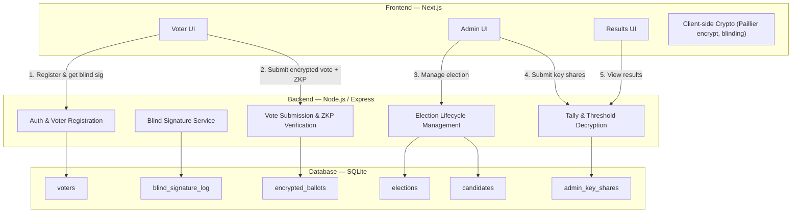

# S009 — Secure & Private E-Voting Prototype: Implementation Plan

## Goal

Build a full-stack electronic voting system from scratch that guarantees vote **confidentiality**, **integrity**, and **anonymity** using Paillier homomorphic encryption, RSA blind signatures, Sigma-protocol ZKPs, and Shamir's Secret Sharing for threshold decryption.

---

## System Overview



---

## Complete Voting Flow

### Phase 0 — Election Setup (Admin)

```
1. Admin creates election (title, description, start/end times)
2. System generates Paillier keypair (pubKey, privKey)
3. privKey split into n shares via Shamir's SS (e.g., 3 shares, threshold = 2)
4. Each share distributed to a different admin → stored encrypted per admin
5. pubKey stored with the election record (public)
6. Admin adds candidates to the election
7. Admin publishes election (status: OPEN)
```

### Phase 1 — Voter Registration + Blind Signature

```
1. Voter registers with credentials (email/student-ID + password)
2. Server verifies identity (checks voter is eligible, hasn't already registered for this election)
3. Voter generates a random ballot token T
4. Voter blinds T:  T' = T × r^e mod n  (using RSA blinding)
5. Voter sends T' to server
6. Server signs T':  S' = (T')^d mod n  (server CANNOT see T)
7. Server records that this voter received a blind signature (prevents double-registration)
8. Voter receives S', unblinds:  S = S' × r^(-1) mod n
9. Voter now has (T, S) — a valid anonymous ballot token
```

### Phase 2 — Casting a Vote

```
1. Voter selects candidate (say candidate index = 2 out of 4 candidates)
2. For each candidate i, voter creates a binary vote:
   - v_i = 1 if i == selected candidate, else v_i = 0
3. Voter encrypts each v_i with Paillier pubKey:
   - c_i = Paillier.encrypt(v_i, pubKey)
4. Voter generates ZKP for each c_i:
   - Proves c_i encrypts either 0 or 1 (Sigma protocol / disjunctive proof)
5. Voter generates ZKP that sum of all v_i = 1:
   - Uses homomorphic property: product of all c_i should decrypt to 1
6. Voter submits: { ballotToken: T, signature: S, ciphertexts: [c_1..c_k], proofs: [...] }
7. Server verifies:
   a. Signature S is valid for token T (RSA verify)
   b. Token T has not been used before (prevents double voting)
   c. All ZKPs are valid
8. Server stores the encrypted ballot, marks token T as used
9. Server CANNOT link ballot to voter identity (anonymous token!)
```

### Phase 3 — Tallying

```
1. Election period ends (status: CLOSED)
2. For each candidate i, server computes homomorphic sum:
   - C_i = c_i^(1) × c_i^(2) × ... × c_i^(N) mod n²
   - This equals Paillier.encrypt(sum of all votes for candidate i)
3. t-of-n admins submit their key shares
4. Shamir's SS reconstructs the private key from t shares
5. Server decrypts each C_i → gets total votes per candidate
6. Individual votes are NEVER decrypted
7. Results published
```

---

## Project Structure

```
secure-e-voting/
├── package.json
├── .env
│
├── backend/
│   ├── server.js                    # Express entry point
│   ├── config/
│   │   └── database.js              # DB connection
│   │
│   ├── crypto/
│   │   ├── paillier.js              # Paillier keypair gen, encrypt, decrypt, homomorphic add
│   │   ├── shamir.js                # Shamir's Secret Sharing (split / reconstruct)
│   │   ├── blindSignature.js        # RSA blind sign / verify
│   │   └── zkp.js                   # Sigma-protocol ZKP (prove 0-or-1, verify)
│   │
│   ├── models/
│   │   ├── Voter.js
│   │   ├── Election.js
│   │   ├── Candidate.js
│   │   ├── Ballot.js
│   │   └── KeyShare.js
│   │
│   ├── routes/
│   │   ├── auth.js                  # Register, login, logout
│   │   ├── elections.js             # CRUD elections, lifecycle
│   │   ├── vote.js                  # Blind signature request, submit ballot
│   │   ├── tally.js                 # Submit key shares, decrypt tally
│   │   └── admin.js                 # Admin management
│   │
│   ├── middleware/
│   │   ├── auth.js                  # JWT verification
│   │   └── adminOnly.js             # Admin role check
│   │
│   └── tests/
│       ├── paillier.test.js
│       ├── shamir.test.js
│       ├── blindSignature.test.js
│       ├── zkp.test.js
│       └── integration.test.js
│
├── frontend/
│   ├── package.json
│   ├── next.config.js
│   │
│   ├── lib/
│   │   ├── paillier.js              # Client-side Paillier encryption
│   │   ├── blinding.js              # RSA blinding/unblinding logic
│   │   ├── zkp.js                   # ZKP generation (client-side)
│   │   └── api.js                   # API client wrapper
│   │
│   ├── pages/ (or app/)
│   │   ├── index.js                 # Landing / election list
│   │   ├── register.js              # Voter registration
│   │   ├── login.js                 # Voter login
│   │   ├── vote/[electionId].js     # Voting page
│   │   ├── results/[electionId].js  # Results page
│   │   ├── admin/
│   │   │   ├── index.js             # Admin dashboard
│   │   │   ├── elections/
│   │   │   │   ├── create.js        # Create election + key ceremony
│   │   │   │   └── [id]/manage.js   # Manage specific election
│   │   │   └── tally/[id].js        # Key share submission + tally
│   │   └── _app.js
│   │
│   ├── components/
│   │   ├── Navbar.js
│   │   ├── CandidateCard.js
│   │   ├── VoteConfirmation.js
│   │   ├── ResultsChart.js
│   │   ├── KeyShareInput.js
│   │   └── ElectionStatus.js
│   │
│   └── styles/
│       └── globals.css
│
└── docs/
    ├── threat_model.md
    ├── attack_evaluation.md
    └── crypto_explanation.md
```

---

## Detailed Task Breakdown

### Milestone 1 — Cryptographic Core (`backend/crypto/`)

#### Task 1.1 — Paillier Homomorphic Encryption (`paillier.js`)

- Implement `generateKeypair(bitLength)` → `{ publicKey: {n, g}, privateKey: {lambda, mu} }`
- Implement `encrypt(plaintext, publicKey)` → `ciphertext` (BigInt)
- Implement `decrypt(ciphertext, privateKey, publicKey)` → `plaintext`
- Implement `addEncrypted(c1, c2, publicKey)` → `c3` (homomorphic: dec(c3) = dec(c1)+dec(c2))
- Implement `addConstant(c, k, publicKey)` → (multiply plaintext by constant)
- Use native `BigInt` for all math; need: modPow, modInverse, gcd helpers
- **Test**: encrypt(3) ⊕ encrypt(5) decrypts to 8

#### Task 1.2 — Shamir's Secret Sharing (`shamir.js`)

- Implement `split(secret, n, threshold)` → `[{x, y}, ...]` (n shares)
- Implement `reconstruct(shares)` → `secret` (using Lagrange interpolation)
- All arithmetic in a large prime field (use BigInt)
- **Test**: split a secret into 5 shares, reconstruct with any 3 → get original secret

#### Task 1.3 — RSA Blind Signatures (`blindSignature.js`)

- Implement `generateRSAKeypair(bitLength)` → `{ e, d, n }`
- Implement `blind(message, r, e, n)` → `blindedMessage`
- Implement `sign(blindedMessage, d, n)` → `blindedSignature`
- Implement `unblind(blindedSignature, r, n)` → `signature`
- Implement `verify(message, signature, e, n)` → `boolean`
- **Test**: full round-trip: blind → sign → unblind → verify = true

#### Task 1.4 — Zero-Knowledge Proof (`zkp.js`)

- Implement proof that a Paillier ciphertext encrypts 0 or 1:
  - Disjunctive Chaum-Pedersen style proof adapted for Paillier
  - Prover: `generateProof(plaintext, ciphertext, randomness, publicKey)` → `proof`
  - Verifier: `verifyProof(ciphertext, proof, publicKey)` → `boolean`
- Implement proof that sum of encrypted values = 1 (exactly one candidate selected)
- **Test**: valid proof for encrypt(0) → passes; valid proof for encrypt(1) → passes; forged proof for encrypt(2) → fails

---

### Milestone 2 — Database Schema

#### Task 2.1 — Database Setup

Using SQLite (via `better-sqlite3`) for simplicity.

**Tables:**

```sql
-- Users / Voters
CREATE TABLE voters (
    id            INTEGER PRIMARY KEY AUTOINCREMENT,
    email         TEXT UNIQUE NOT NULL,
    password_hash TEXT NOT NULL,
    name          TEXT NOT NULL,
    role          TEXT DEFAULT 'voter',  -- 'voter' or 'admin'
    created_at    DATETIME DEFAULT CURRENT_TIMESTAMP
);

-- Elections
CREATE TABLE elections (
    id              INTEGER PRIMARY KEY AUTOINCREMENT,
    title           TEXT NOT NULL,
    description     TEXT,
    status          TEXT DEFAULT 'SETUP',  -- SETUP, OPEN, CLOSED, TALLIED
    paillier_pub_n  TEXT NOT NULL,          -- public key n (hex string)
    paillier_pub_g  TEXT NOT NULL,          -- public key g (hex string)
    rsa_pub_e       TEXT NOT NULL,          -- RSA e for blind sigs
    rsa_pub_n       TEXT NOT NULL,          -- RSA n for blind sigs
    threshold       INTEGER NOT NULL,       -- t in (t,n) sharing
    total_shares    INTEGER NOT NULL,       -- n in (t,n) sharing
    start_time      DATETIME,
    end_time        DATETIME,
    created_at      DATETIME DEFAULT CURRENT_TIMESTAMP
);

-- Candidates
CREATE TABLE candidates (
    id          INTEGER PRIMARY KEY AUTOINCREMENT,
    election_id INTEGER REFERENCES elections(id),
    name        TEXT NOT NULL,
    party       TEXT,
    position    INTEGER NOT NULL           -- order index (0, 1, 2, ...)
);

-- Encrypted Ballots (anonymous — NO voter_id!)
CREATE TABLE ballots (
    id            INTEGER PRIMARY KEY AUTOINCREMENT,
    election_id   INTEGER REFERENCES elections(id),
    ballot_token  TEXT NOT NULL,            -- the anonymous token T
    ciphertexts   TEXT NOT NULL,            -- JSON array of encrypted votes per candidate
    proofs        TEXT NOT NULL,            -- JSON array of ZKPs
    submitted_at  DATETIME DEFAULT CURRENT_TIMESTAMP
);

-- Used tokens (prevent double-voting)
CREATE TABLE used_tokens (
    token_hash  TEXT PRIMARY KEY,           -- hash of token (not raw token)
    election_id INTEGER REFERENCES elections(id),
    used_at     DATETIME DEFAULT CURRENT_TIMESTAMP
);

-- Admin Key Shares
CREATE TABLE key_shares (
    id          INTEGER PRIMARY KEY AUTOINCREMENT,
    election_id INTEGER REFERENCES elections(id),
    admin_id    INTEGER REFERENCES voters(id),
    share_x     TEXT NOT NULL,              -- share index
    share_y     TEXT NOT NULL,              -- share value (encrypted)
    submitted   BOOLEAN DEFAULT FALSE       -- has admin submitted for tallying?
);

-- Blind Signature Log (tracks who got a signature, NOT what they voted)
CREATE TABLE blind_sig_log (
    id          INTEGER PRIMARY KEY AUTOINCREMENT,
    election_id INTEGER REFERENCES elections(id),
    voter_id    INTEGER REFERENCES voters(id),
    issued_at   DATETIME DEFAULT CURRENT_TIMESTAMP,
    UNIQUE(election_id, voter_id)           -- one signature per voter per election
);
```

> [!IMPORTANT]
> The `ballots` table has **no reference to `voters`**. This is the core anonymity guarantee — submitted ballots cannot be linked back to any voter identity.

---

### Milestone 3 — Backend API (`backend/routes/`)

#### Task 3.1 — Auth Routes (`auth.js`)

| Endpoint             | Method | Description                            |
| -------------------- | ------ | -------------------------------------- |
| `/api/auth/register` | POST   | Register voter (email, password, name) |
| `/api/auth/login`    | POST   | Login → JWT token                      |
| `/api/auth/me`       | GET    | Get current user profile               |

- Passwords hashed with `bcrypt`
- JWT tokens with `jsonwebtoken`

#### Task 3.2 — Election Routes (`elections.js`)

| Endpoint                        | Method | Auth  | Description                             |
| ------------------------------- | ------ | ----- | --------------------------------------- |
| `/api/elections`                | GET    | Any   | List all elections                      |
| `/api/elections/:id`            | GET    | Any   | Get election details + candidates       |
| `/api/elections`                | POST   | Admin | Create election (triggers key ceremony) |
| `/api/elections/:id/candidates` | POST   | Admin | Add candidate                           |
| `/api/elections/:id/open`       | POST   | Admin | Open voting period                      |
| `/api/elections/:id/close`      | POST   | Admin | Close voting period                     |

On `POST /api/elections`:

1. Generate Paillier keypair
2. Generate RSA keypair (for blind signatures)
3. Split Paillier private key via Shamir's SS into `n` shares
4. Store public keys in `elections` table
5. Encrypt and distribute shares to admin `key_shares` records

#### Task 3.3 — Voting Routes (`vote.js`)

| Endpoint                           | Method | Auth     | Description                               |
| ---------------------------------- | ------ | -------- | ----------------------------------------- |
| `/api/vote/:electionId/blind-sign` | POST   | Voter    | Submit blinded token, get blind signature |
| `/api/vote/:electionId/submit`     | POST   | **None** | Submit anonymous encrypted ballot         |

> [!WARNING]
> The vote submission endpoint has **no authentication**. This is by design — authentication would link the ballot to a voter identity, breaking anonymity. The blind signature on the token is the authorization mechanism.

**`/blind-sign` flow:**

1. Verify voter is authenticated and eligible
2. Check voter hasn't already received a signature for this election
3. Sign the blinded token with election's RSA private key
4. Record in `blind_sig_log`
5. Return blinded signature

**`/submit` flow (anonymous — no auth!):**

1. Receive `{ ballotToken, signature, ciphertexts[], proofs[] }`
2. Verify RSA signature on ballot token
3. Check token hasn't been used (via `used_tokens` hash)
4. Verify all ZKPs
5. Store in `ballots` table
6. Mark token as used

#### Task 3.4 — Tally Routes (`tally.js`)

| Endpoint                              | Method | Auth  | Description         |
| ------------------------------------- | ------ | ----- | ------------------- |
| `/api/tally/:electionId/submit-share` | POST   | Admin | Submit key share    |
| `/api/tally/:electionId/result`       | GET    | Any   | Get tallied results |

**Tally flow:**

1. Election must be CLOSED
2. Admins submit their key shares
3. Once threshold reached → reconstruct Paillier private key
4. For each candidate, compute homomorphic product of all ballots' ciphertexts
5. Decrypt each aggregate → total votes per candidate
6. Store results, update election status to TALLIED
7. **Erase reconstructed private key from memory**

---

### Milestone 4 — Frontend (`frontend/`)

#### Task 4.1 — Layout & Navigation

- Shared layout with Navbar (logo, election list, login/register, admin link)
- Responsive design with modern styling

#### Task 4.2 — Auth Pages (`register.js`, `login.js`)

- Registration form (name, email, password)
- Login form → store JWT
- Protected route wrapper component

#### Task 4.3 — Election List & Details ([index.js](file:///d:/GitHub/voting-dapp-master/voting-dapp-master/frontend/pages/index.js), `vote/[electionId].js`)

- List elections with status badges (SETUP / OPEN / CLOSED / TALLIED)
- Election detail: candidates, time remaining, voter status

#### Task 4.4 — Voting Flow Page (the most complex page)

**Page: `vote/[electionId].js`**

Step-by-step guided UI:

| Step | UI                         | Crypto Operation (client-side)                       |
| ---- | -------------------------- | ---------------------------------------------------- |
| 1    | "Preparing your ballot..." | Generate random ballot token T and blinding factor r |
| 2    | "Getting authorization..." | Blind T, POST to `/blind-sign`, unblind signature    |
| 3    | "Select your candidate"    | User picks a candidate                               |
| 4    | "Encrypting your vote..."  | For each candidate, Paillier-encrypt 0 or 1          |
| 5    | "Generating proof..."      | Generate ZKPs (vote is 0-or-1, sum is 1)             |
| 6    | "Submitting..."            | POST to `/submit` (anonymous, no auth header)        |
| 7    | "Vote cast!"               | Show confirmation                                    |

> [!IMPORTANT]
> Steps 1–2 use the voter's auth token (proving identity for blind signature). Steps 4–6 happen **without** any auth token (anonymous submission). This separation is key to anonymity.

#### Task 4.5 — Results Page (`results/[electionId].js`)

- Bar chart / pie chart of results (use Recharts)
- "Election not yet tallied" state
- Display cryptographic audit info

#### Task 4.6 — Admin Pages

- **Create Election**: form + key ceremony UI (shows generated shares)
- **Manage Election**: add candidates, open/close voting
- **Tally**: submit key share, see threshold status, trigger decryption

---

### Milestone 5 — Documentation (`docs/`)

#### Task 5.1 — Threat Model (`threat_model.md`)

Document adversary types and assets at risk.

#### Task 5.2 — Attack Evaluation (`attack_evaluation.md`)

| Attack               | Vector                   | Mitigation                                   | Residual Risk |
| -------------------- | ------------------------ | -------------------------------------------- | ------------- |
| Vote Buying/Coercion | Voter proves their vote  | No receipt issued                            | Low           |
| Double Voting        | Same voter submits twice | One blind sig per voter; used-token tracking | None          |
| Ballot Stuffing      | Fake ballots injected    | Blind signature verification                 | None          |
| Vote Manipulation    | Alter encrypted vote     | ZKP + no private key on server               | None          |
| Single Admin Decrypt | Rogue admin              | Shamir threshold required                    | None          |
| Invalid Vote         | Encrypt(999)             | ZKP proves value ∈ {0,1}                     | None          |
| Sybil Attack         | Multiple identities      | Identity verification at registration        | Medium        |
| Front-Running        | Eavesdrop on votes       | Paillier ciphertexts, no info leak           | None          |
| Admin Collusion      | t admins collude         | Can only decrypt aggregate, not individual   | None          |
| Token Replay         | Reuse token              | Token hash in `used_tokens`                  | None          |
| Server Compromise    | Controls backend         | No full private key; blind sig log ≠ ballots | Low-Medium    |

#### Task 5.3 — Crypto Explanation (`crypto_explanation.md`)

- Paillier encryption math with worked examples
- Shamir's SS with polynomial interpolation
- Blind signature protocol step-by-step
- ZKP Sigma protocol explanation

---

## Technology Stack

| Layer    | Technology              | Why                                   |
| -------- | ----------------------- | ------------------------------------- |
| Frontend | Next.js 14              | SSR, routing, React                   |
| Styling  | Tailwind CSS            | Rapid responsive UI                   |
| Backend  | Node.js + Express       | Same language for crypto code sharing |
| Database | SQLite (better-sqlite3) | Zero-config, perfect for prototype    |
| Crypto   | Native BigInt + custom  | Educational; shows understanding      |
| Auth     | bcrypt + JWT            | Standard, simple                      |
| Charts   | Recharts                | Results visualization                 |
| Testing  | Jest                    | Unit + integration tests              |

---

## Verification Plan

### Automated Tests (Jest)

```bash
cd backend && npx jest
```

| Test File                | What It Verifies                                                        |
| ------------------------ | ----------------------------------------------------------------------- |
| `paillier.test.js`       | Encrypt/decrypt roundtrip; homomorphic addition; edge cases             |
| `shamir.test.js`         | Split/reconstruct roundtrip; threshold property (t-1 shares fail)       |
| `blindSignature.test.js` | Blind/sign/unblind/verify roundtrip; tampered sig rejected              |
| `zkp.test.js`            | Valid proofs pass; invalid proofs fail; forged proofs fail              |
| `integration.test.js`    | Full flow: keygen → split → encrypt → aggregate → reconstruct → decrypt |

### Manual Testing

1. **Register/login** as voter and admin
2. **Create election** as admin → observe key shares
3. **Register for election** as voter → get blind signature
4. **Cast a vote** → observe encryption client-side
5. **Try voting twice** → should be rejected
6. **Close election, submit shares, tally** → verify correct totals
7. **View results** → check totals match

---

## Implementation Order

```mermaid
gantt
    title S009 Implementation Timeline
    dateFormat  X
    axisFormat %s

    section Crypto Core
    Paillier encryption       :a1, 0, 2
    Shamir's SS               :a2, 0, 1
    RSA Blind Signatures      :a3, 1, 2
    ZKP Sigma protocol        :a4, 2, 2

    section Backend
    DB schema + models        :b1, 1, 1
    Auth routes               :b2, 2, 1
    Election routes           :b3, 3, 1
    Voting routes             :b4, 3, 2
    Tally routes              :b5, 4, 1

    section Frontend
    Layout + Auth pages       :c1, 3, 1
    Election list + detail    :c2, 4, 1
    Voting flow page          :c3, 4, 2
    Admin pages               :c4, 5, 1
    Results page              :c5, 5, 1

    section Docs
    Threat model              :d1, 5, 1
    Attack evaluation         :d2, 5, 1
    Crypto explanation        :d3, 5, 1
```


